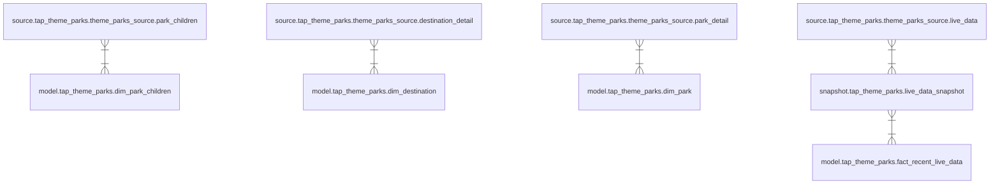

# dbt-tap-theme-parks


dbt models for [tap-theme-parks]() raw data.

This dbt project turns the raw data from `tap-theme-parks` into models about destinations, parks and their attractions, restaurants, shows and so on. 

This project also includes a `live_data_snapshot``, which keeps track of the most recent live data synced from an entity. This snapshot then feeds a fact model containing the most recent live data across everything you have live data for.

See the descriptions and lineage below.

---

## Snapshots

| **snapshot**                       | **description** |
| ------------------------------- | ---------------------------------------------------------------------------------------------------------------------------------- |
| [live_data_snapshot](snapshots/live_data_snapshot.sql)   | Snapshot to track live theme park data. |

## Models

| **model**                       | **description** |
| ------------------------------- | ---------------------------------------------------------------------------------------------------------------------------------- |
| [dim_destination](models/dim_destination.sql)   | Destination dimension table. |
| [dim_park](models/dim_park.sql)   | Park dimension table. |
| [dim_park_Children](models/dim_park_children.sql)   | Park child entity (attractions, restaurants, shows and so on) dimension table. |
| [fact_recent_live_data](models/fact_recent_live_data.sql)   | The most recent live data from all entities the user has synced live data for. This relies on `live_data_snapshot`. |

## Lineage



---

## Installation Instructions
Check [dbt Hub](https://hub.getdbt.com/) for the latest installation instructions, or [read the dbt docs](https://docs.getdbt.com/docs/package-management) for more information on installing packages.

Include in your `packages.yml`

```yaml
packages:
  - package: DanielPDWalker/dbt-tap-theme-parks
    version: [">=0.1.0", "<1.0.0"]
```

### One time setup (after creating a python virtual environment)

    ```
    pip install dbt
    dbt deps
    ```

### development

    ```
    dbt test
    ```

## Database Support
This package has been tested on Postgres.
